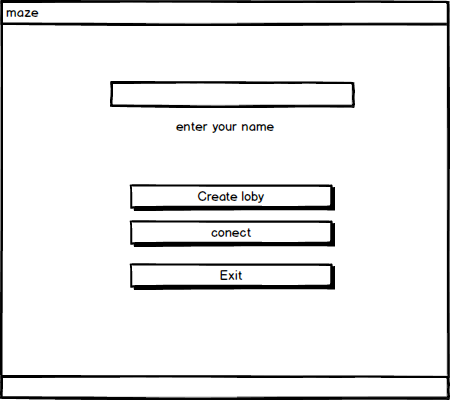
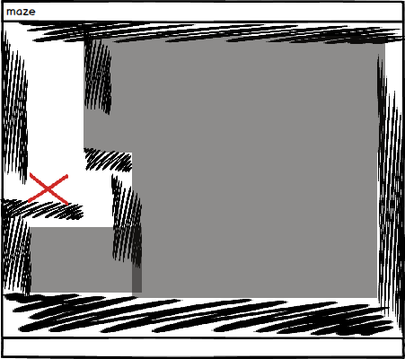
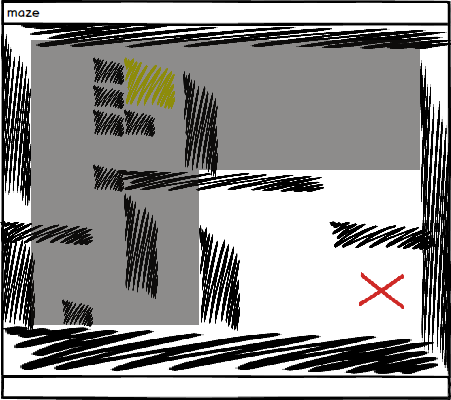
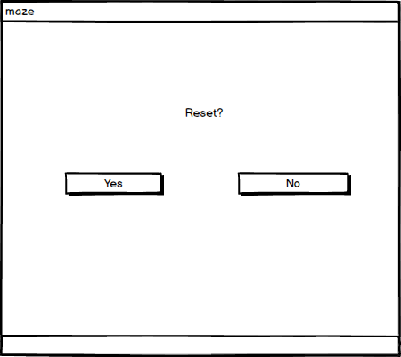


# Требования к проекту
---
### Содержание
1. [Введение](#1)
2. [Требования пользователя](#2)  
  2.1. [Программные интерфейсы](#2.1)  
  2.2. [Интерфейс пользователя](#2.2)  
  2.3. [Характеристики пользователей](#2.3)  
3. [Системные требования](#3)  
  3.1 [Функциональные требования](#3.1)  
  3.2 [Нефункциональные требования](#3.2)  
4. [Правила игры](#4)  
5. [Аналоги](#5)  

### 1. Введение 
В данном проекте будет реализована игра в прятки с элементомы пошагового ассиметричного мультиплеера.Игры такого типа существуютуже давно, но не теряет актуальность.Отличительной особенностью проекта является изменение условий победы смотрите главу правила.
Игры с асинхронным игровым процессом, расчитанным на несколько человек, являются относительно молодой нишей. Такие игры привлекают широкую аудиторию своими ролевыми элементами и большей разнообразностью игрового процесса. Концепция игр по типу "пряток" не утрачивает свою популярность, игры такого рода существуют как на самых первых игровых консолях типа.В attari 2600 так и на современных компьютерах. 
### 2. Требования пользователя 
#### 2.1. Программные интерфейсы <a name="2.1">
- Интерфейс для связи GUI и логики приложения.
- Сокет для связи с сервером.
- Использование libgdx в качестве GUI
#### 2.2. Интерфейс пользователя 
- Главное меню
  
  
- Экран игрока №1, персонаж обозначен красным крестом , видно что игрок не знает о расположении стен на уровне которые еще не видел, игрок не знает о расположении стен в помеченой черным области.

- Экран игрока №2, минотавр обозначен красным крестом, минотавр знает о местоположении стен и сокровищ даже о тех что находятся в помеченой черным области. 
- 
В окне с игрой мы видим, что игровое поле в зависимости от роли в игровом процессе.
-Экран окончания игры

#### 2.3. Характеристики пользователей <a name="2.3">
Целевая аудитория
- Любители классических игр среднеого возраста.
- Аудитория других игр с асимметричным мультиплеером в возрасте до 30. 
### 3. Системные требования <a name="3">
#### 3.1. Функциональные требования 
##### 3.1.1 Основные функции
###### Сыграть матч:
   1. Играть при подключении напарника.
   2. Играть подключившись к уже ожидающему игроку.
   3. Выйти в меню после завершения матча.
   4. Выход из приложения нажатием кнопки в главном меню.
   5. Продолжить игру с найденым напарником.

#### 3.2. Нефункциональные требования 
##### 3.2.1 Атрибуты качества
 - Время ожидания отклика от программы не более 5 секунд.
 - При потери соединения имеется возможность переподключится в течении 30 секунд.
 - Низкое потребление трафика.
##### 3.2.2 Внешние интерфейсы 
 - Назначение элементов интерфейса интуитивно понятно.
 - Управление осуществляется кнопками клавиатуры WASD.
 - Взаимодействие между пользователями осуществляется ,через сервер.
### 4. Правила игры 
Правила игры [Rules](../Game%20rules/rules.md).
### 5. Аналоги 
#### Maze Craze
Игра выпущена в 1978 году компанией Atari, рассчитана на 2 игроков задача которых выбраться из лабиринта быстрее соперника. 
#### Tunnel Runner
Игра-лабиринт от первого лица, выпущенная компанией CBS Electronics в 1983 году для Atari 2600.
Игрок должен выбраться из лабиринта в котором обитают враждебные создания.

